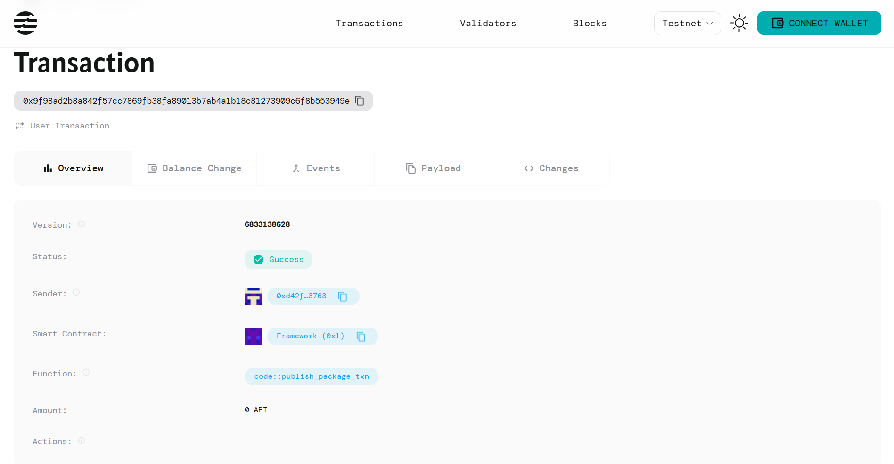

# NFT Evolution Contract

## Project Description
Build NFTs that evolve based on time or user actions. This smart contract creates dynamic NFTs that automatically grow and change their evolution level through user interactions, providing an engaging and interactive digital collectible experience on the Aptos blockchain.

## Project Vision
To revolutionize the NFT ecosystem by creating living, breathing digital assets that respond to user engagement. Our vision is to transform static NFTs into dynamic companions that grow alongside their owners, creating deeper emotional connections and long-term value through interactive evolution mechanics.

We envision a future where NFTs are not just digital art pieces, but interactive digital entities that reward user engagement and create unique, personalized experiences for each holder.

## Key Features

### 🚀 **Simple Evolution Mechanics**
- NFTs start at evolution level 1 and grow infinitely
- Evolution triggered every 5 user interactions
- Straightforward and predictable progression system

### 🎮 **User-Driven Growth**
- Direct interaction system - users actively engage with their NFTs
- Real-time evolution based on interaction frequency
- Gamified experience that encourages regular engagement

### 📊 **Transparent Progress Tracking**
- Visible interaction count for progress monitoring
- Evolution level clearly displayed and tracked
- Last interaction timestamp for activity monitoring

### ⚡ **Lightweight and Efficient**
- Minimal gas costs for interactions
- Simple contract structure for reliability
- Fast transaction processing

### 🔒 **Secure Ownership**
- Each NFT tied to specific owner address
- Secure interaction validation
- Protected evolution mechanics

## Future Scope

### 🎨 **Enhanced Visual Evolution**
- Dynamic metadata updates reflecting evolution levels
- Unique artwork for different evolution stages
- Community-driven art contributions for evolution phases

### 🏆 **Advanced Game Mechanics**
- Special abilities unlocked at certain evolution levels
- Rare evolution paths based on interaction patterns
- Achievement systems and milestone rewards

### 🤝 **Social Features**
- NFT breeding between highly evolved specimens
- Community leaderboards for evolution levels
- Social sharing of evolution milestones

### 💰 **Economic Integration**
- Marketplace premium for higher evolution levels
- Staking rewards based on NFT evolution level
- Trading mechanics that consider evolution status

### 🌐 **Platform Expansion**
- Mobile app for easy NFT interaction
- Cross-chain evolution mechanics
- Integration with gaming platforms and metaverses

### 🔧 **Technical Enhancements**
- Multiple evolution triggers (time, actions, events)
- Complex evolution trees with branching paths
- AI-driven evolution suggestions based on user behavior

## Contract Details
0x9f98ad2b8a842f57cc7869fb38fa89013b7ab4a1b18c81273909c6f8b553949e
